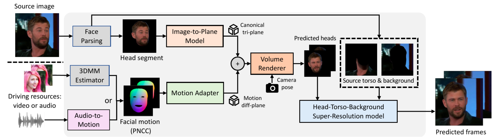

# Real3D-Portrait: One-shot Realistic 3D Talking Portrait Synthesis | ICLR 2024 Spotlight
[](https://arxiv.org/abs/2401.08503)| [](https://github.com/yerfor/Real3DPortrait) | [中文文档](./README-zh.md)

This is the official repo of Real3D-Portrait with Pytorch implementation, for one-shot and high video reality talking portrait synthesis. You can visit our [Demo Page](https://real3dportrait.github.io/) for watching demo videos, and read our [Paper](https://arxiv.org/pdf/2401.08503.pdf) for technical details.

<p align="center">
    <br>
    
    <br>
</p>

# 🔥MimicTalk Released
**We have released the code of MimicTalk ([https://github.com/yerfor/MimicTalk/](https://github.com/yerfor/MimicTalk/)), which is a SOTA NeRF-based person-specific talking face method and achieves better visual quality and enables talking style control.**

## 🔥 Update
- \[2024.07.02\] We release the training code of the whole system, including audio-to-motion model, image-to-plane model, secc2plane model, and the secc2plane_torso model, please refer to `docs/train_models`. We also release the code to preprocess and binarize the dataset, please refer to `docs/process_data`. Thanks for your patience!

## You may also interested in 
- We release the code of GeneFace++, ([https://github.com/yerfor/GeneFacePlusPlus](https://github.com/yerfor/GeneFacePlusPlus)), a NeRF-based person-specific talking face system, which aims at producing high-quality talking face videos with extreme idenetity-similarity of the target person.

# Quick Start!
## Environment Installation
Please refer to [Installation Guide](docs/prepare_env/install_guide.md), prepare a Conda environment `real3dportrait`.
## Download Pre-trained & Third-Party Models
### 3DMM BFM Model
Download 3DMM BFM Model from [Google Drive](https://drive.google.com/drive/folders/1o4t5YIw7w4cMUN4bgU9nPf6IyWVG1bEk?usp=sharing) or [BaiduYun Disk](https://pan.baidu.com/s/1aqv1z_qZ23Vp2VP4uxxblQ?pwd=m9q5 ) with Password m9q5. 


Put all the files in `deep_3drecon/BFM`, the file structure will be like this:
```
deep_3drecon/BFM/
├── 01_MorphableModel.mat
├── BFM_exp_idx.mat
├── BFM_front_idx.mat
├── BFM_model_front.mat
├── Exp_Pca.bin
├── facemodel_info.mat
├── index_mp468_from_mesh35709.npy
└── std_exp.txt
```

### Pre-trained Real3D-Portrait
Download Pre-trained Real3D-Portrait：[Google Drive](https://drive.google.com/drive/folders/1MAveJf7RvJ-Opg1f5qhLdoRoC_Gc6nD9?usp=sharing) or [BaiduYun Disk](https://pan.baidu.com/s/1Mjmbn0UtA1Zm9owZ7zWNgQ?pwd=6x4f ) with Password 6x4f
  
Put the zip files in `checkpoints` and unzip them, the file structure will be like this:
```
checkpoints/
├── 240210_real3dportrait_orig
│   ├── audio2secc_vae
│   │   ├── config.yaml
│   │   └── model_ckpt_steps_400000.ckpt
│   └── secc2plane_torso_orig
│       ├── config.yaml
│       └── model_ckpt_steps_100000.ckpt
└── pretrained_ckpts
    └── mit_b0.pth
```

## Inference
Currently, we provide **CLI**, **Gradio WebUI** and **Google Colab** for inference. We support both Audio-Driven and Video-Driven methods:

- For audio-driven, at least prepare `source image` and `driving audio`
- For video-driven, at least prepare `source image` and `driving expression video`

### Gradio WebUI
Run Gradio WebUI demo, upload resouces in webpage，click `Generate` button to inference：
```bash
python inference/app_real3dportrait.py
```

### Google Colab
Run all the cells in this [Colab](https://colab.research.google.com/github/yerfor/Real3DPortrait/blob/main/inference/real3dportrait_demo.ipynb).

### CLI Inference
Firstly, switch to project folder and activate conda environment:
```bash
cd <Real3DPortraitRoot>
conda activate real3dportrait
export PYTHONPATH=./
```
For audio-driven, provide source image and driving audio:
```bash
python inference/real3d_infer.py \
--src_img <PATH_TO_SOURCE_IMAGE> \
--drv_aud <PATH_TO_AUDIO> \
--drv_pose <PATH_TO_POSE_VIDEO, OPTIONAL> \
--bg_img <PATH_TO_BACKGROUND_IMAGE, OPTIONAL> \
--out_name <PATH_TO_OUTPUT_VIDEO, OPTIONAL>
```
For video-driven, provide source image and driving expression video(as `--drv_aud` parameter):
```bash
python inference/real3d_infer.py \
--src_img <PATH_TO_SOURCE_IMAGE> \
--drv_aud <PATH_TO_EXP_VIDEO> \
--drv_pose <PATH_TO_POSE_VIDEO, OPTIONAL> \
--bg_img <PATH_TO_BACKGROUND_IMAGE, OPTIONAL> \
--out_name <PATH_TO_OUTPUT_VIDEO, OPTIONAL>
```
Some optional parameters：
- `--drv_pose` provide motion pose information, default to be static poses
- `--bg_img` provide background information, default to be image extracted from source
- `--mouth_amp` mouth amplitude, higher value leads to wider mouth
- `--map_to_init_pose` when set to `True`, the initial pose will be mapped to source pose, and other poses will be equally transformed
- `--temperature` stands for the sampling temperature of audio2motion, higher for more diverse results at the expense of lower accuracy
- `--out_name` When not assigned, the results will be stored at `infer_out/tmp/`.
- `--out_mode` When `final`, only outputs the final result; when `concat_debug`, also outputs visualization of several intermediate process.

Commandline example:
```bash
python inference/real3d_infer.py \
--src_img data/raw/examples/Macron.png \
--drv_aud data/raw/examples/Obama_5s.wav \
--drv_pose data/raw/examples/May_5s.mp4 \
--bg_img data/raw/examples/bg.png \
--out_name output.mp4 \
--out_mode concat_debug
```

# ToDo
- [x] **Release Pre-trained weights of Real3D-Portrait.**
- [x] **Release Inference Code of Real3D-Portrait.**
- [x] **Release Gradio Demo of Real3D-Portrait..**
- [x] **Release Google Colab of Real3D-Portrait..**
- [x] **Release Training Code of Real3D-Portrait.**

# Disclaimer
Any organization or individual is prohibited from using any technology mentioned in this paper to generate someone's talking video without his/her consent, including but not limited to government leaders, political figures, and celebrities. If you do not comply with this item, you could be in violation of copyright laws.

# Citation
If you found this repo helpful to your work, please consider cite us:
```
@article{ye2024real3d,
  title={Real3D-Portrait: One-shot Realistic 3D Talking Portrait Synthesis},
  author={Ye, Zhenhui and Zhong, Tianyun and Ren, Yi and Yang, Jiaqi and Li, Weichuang and Huang, Jiawei and Jiang, Ziyue and He, Jinzheng and Huang, Rongjie and Liu, Jinglin and others},
  journal={arXiv preprint arXiv:2401.08503},
  year={2024}
}
@article{ye2023geneface++,
  title={GeneFace++: Generalized and Stable Real-Time Audio-Driven 3D Talking Face Generation},
  author={Ye, Zhenhui and He, Jinzheng and Jiang, Ziyue and Huang, Rongjie and Huang, Jiawei and Liu, Jinglin and Ren, Yi and Yin, Xiang and Ma, Zejun and Zhao, Zhou},
  journal={arXiv preprint arXiv:2305.00787},
  year={2023}
}
@article{ye2023geneface,
  title={GeneFace: Generalized and High-Fidelity Audio-Driven 3D Talking Face Synthesis},
  author={Ye, Zhenhui and Jiang, Ziyue and Ren, Yi and Liu, Jinglin and He, Jinzheng and Zhao, Zhou},
  journal={arXiv preprint arXiv:2301.13430},
  year={2023}
}
```
